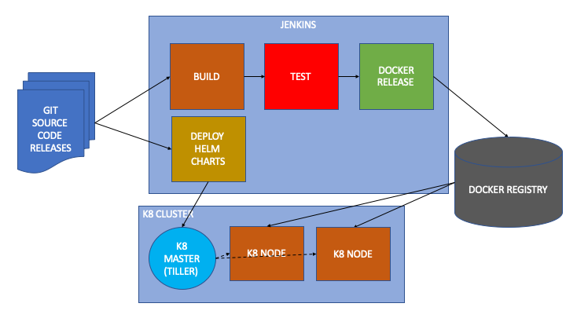

k8-barona
---------

Summary
-------
This project is a demo showing the strength of using dockerization and orchestration technologies by automating the deployment of a simple web app that connects to a database.

Deep Dive
---------

The system includes a web application capable of serving HTTP requests via REST APIs to track attendance of a group of people.
All components are dockerized and is maintained using semantic versioning.
Deployment and configuration management is handled by Kubernetes.
Packaging is maintained using Helm.



The flow described below:
1. Git Source Code contains the applications, Dockerfiles, yaml files and Helm charts where all the source code and automation will come from.
2. Jenkins as a CI tool can build and test source codes. It can also run security checks and smoke tests.
3. CI tool can launch Docker releases which will use semantic versions in tags to track changes, and push to a repository management tool like docker registry.
4. Helm charts contains and describe all the yamls of the Kubernetes package. It can be triggered automatically or manually.
5. Tiller in the K8 cluster will provision deployments, pods and services object inside Kubernetes.

Web Application: Written using DjangoRestFramework.
Database: Single PSQL instance. 

Installation Prerequisites
--------------------------

All development and testing are done in a single node Kubernetes Cluster running in MacOS Mojave Environment - MBP 18.5.0 Darwin Kernel Version 18.5.0.
It is assumed that all deployments  are compatible to any Linux-based distribution given the required installations, dependencies and permissions are provided.

- Docker Desktop (https://www.docker.com/products/docker-desktop)
Docker Desktop is an application for MacOS and Windows machines, delivering the easiest and fastest way to build production-ready container applications for Kubernetes or Swarm, working with any framework and language and targeting any platform.

- Kubernetes Dashboard (https://github.com/kubernetes/dashboard)
Kubernetes Dashboard is a general purpose, web-based UI for Kubernetes clusters. It allows users to manage applications running in the cluster and troubleshoot them, as well as manage the cluster itself.

To install the kubernetes-dashboard in the kubernetes cluster
``` 
kubectl apply -f https://raw.githubusercontent.com/kubernetes/dashboard/v1.10.1/src/deploy/recommended/kubernetes-dashboard.yaml
```

To install the RBAC Auth to allow cluster-admin access to the UI
```
kubectl apply -f kubernetes-dashboard/dashboard-admin.yml
```
https://github.com/kubernetes/dashboard/wiki/Access-control#admin-privileges

- Helm (https://github.com/helm/helm)
Helm is a tool for managing Kubernetes charts. Charts are packages of pre-configured Kubernetes resources.
``` 
brew install kubernetes-helm
helm init
```

- Python 3 (https://www.python.org/download/releases/3.0/)
Python is a general-purpose interpreted, interactive, object-oriented, and high-level programming language.
Already installed in most of the Linux distributions.

```
python --version
Python 3.7.2
```

- Django REST Framework for development (https://www.django-rest-framework.org/)
Django REST framework is a powerful and flexible toolkit for building Web APIs.


Creating the Django web application
-----------------------------------
The Django application requires Python3 Environment for development and test running the server. It is best to create a virtual environment to not affect any dependencies already installed as majority of Linux based distros have Python 2.7 already in place. 

Create and activate the virtual environment
``` 
virtualenv ~/.virtualenvironments/k8-barona
source ~/.virtualenvironments/k8-barona/bin/activate
```

Install all required packages
```
pip3 install -r requirements.txt
```
Start Django project and Table app
```
django-admin startproject web
cd web
python3 manage.py startapp table
```

How to use the web application
------------------------------
All services in the web application are accessed via HTTP request. But the web application is dependent on a running psql db instance.
A successful connection should first be established before running the web app. A dockerized instance can be used for development purposes.

``` 
docker run --name myapp-database \
    -e POSTGRES_PASSWORD=postgres \
    -e POSTGRES_USER=postgres \
    -e POSTGRES_DB=myapp_db \
    -p 5432:5432 -d postgres:alpine
```

Migration of database models are required. This can verify the connectivity to the psql server:
``` 
python3 manage.py migrate
```

If the database is already running and the db schema updated, Django server can already be run:
```
python3 manage.py runserver <port>
```

After this, the web application should already be running locally.
```
Django version 2.1, using settings 'web.settings'
Starting development server at http://127.0.0.1:8080/
Quit the server with CONTROL-C.
```

**ENV VAR Map**

_DATABASE_NAME_ : PSQL database name to connect to. Default to "myapp_db"

_DATABASE_USER_ : PSQL database user for connecting to the db. Must have proper permissions. Default to "postgres"

_DATABASE_PASSWORD_ : PSQL password of the user above. Default to "postgres"

_DATABASE_HOSTNAME_ : PSQL instance to connect to: Default to "myapp-database"

_DATABASE_PORT_ : Port used by PSQL instance : Default to "5432"


**REST API Map**

_GET http://localhost:port/admin_ : Django default admin page. Can be use for healthcheck.

_GET http://localhost:port/table_ : Index page for testing.

_POST http://localhost:port/table/create_ : Create attendance entry in attendance table sheet
```
{
    "firstname":"Arvin",
    "lastname":"Cudanin",
    "gate":"A"
}
```

_GET http://localhost:port/table/view/date:YYYYMMDD_ : View complete attendance sheet for a certain date

Application build, versioning and docker releases
-------------------------------------------------
Semantic versioning is used for this project. A git repository tracks all code changes and releases.
https://github.com/kuyatechie/k8-barona/

A docker registry is required for this. This registry should be able to store docker releases and the Kubernetes should be able to pull the images from this registry.
It can also be set up locally for ease of usage.

To build and release the web application, a base Python docker image is needed. This is to cut external dependencies from outside the network and to speed up builds requiring no changes in dependencies.
``` 
docker build --tag <docker_registry>/python:k8-barona-dev web/
```

Everything is deployed via containers. To package a certain version, docker tags are used.
```
docker build --tag <docker_registry>/myapp:<version>  web/web/
```

Now we are ready to deploy the containers in the Kubernetes Cluster.

Deployment to Kubernetes Cluster
--------------------------------
Kubernetes scripts consist of multiple yaml files that describe how application components are integrated, deployed and maintained.

For this deployment efforts, the 

A sample stable release is located in myapp-k8-stable folder. It can be deployed independently using kubectl command. 

``` 
kubectl apply -f <yaml_file>
```

However, there are limitations in doing this repetitively on deploying to different environments as it is hard to track components that belongs to a single package, and also to manage upgrades.

To address that issue, Helm charts are used for maintaining Kubernetes packages. 

The current containerized release can be put into a Kubernetes package and can be deployed instantaneously by using helm.

First, modify the required variables in the helm/myapp/templates/values.yaml file
``` 
myappTag: 1.1.0
myappPort: 8000
imageRegistry: localhost
pullPolicy: Never
databasePassword: postgres
databaseUser: postgres
databaseName: myapp_db
databaseHostnameSuffix: database
databaseMigrationSuffix: 1-1-0
```

_myappTag_: This tag is the released docker image available of the application that is to be deployed.

_myappPort_: The port used by the web application to connect to.

_imageRegistry_: The docker registry where the images are going to be pulled from.

_pullPolicy_: The behaviour of every deployment with regards to automatically pulling from the source.

_databaseUser_: PSQL database user for connecting to the db.

_databasePassword_: PSQL password of the user above.

_databaseName_: PSQL database name to connect to.

_databaseHostnameSuffix_: String suffix to append to the database hostname.

_databaseMigrationSuffix_: String suffix to append to the migrate job. Must be unique for every releases requiring database schema updates.

Running Helm Chart Deployment
-----------------------------
To test deploy, use the following command. It will return a unique installation name to let user recognize all related components deployed under one package.

``` 
helm install helm/myapp
```

In this sample case, the installation name provided by helm is "existing-tarsier"
``` 
arvin$ helm install helm/myapp
NAME:   existing-tarsier
LAST DEPLOYED: Mon Jun 24 09:12:21 2019
NAMESPACE: default
STATUS: DEPLOYED

RESOURCES:
==> v1/Deployment
NAME                         READY  UP-TO-DATE  AVAILABLE  AGE
existing-tarsier-deployment  0/1    0           0          1s

==> v1/Job
NAME                            COMPLETIONS  DURATION  AGE
existing-tarsier-migrate-1-1-0  0/1          0s        1s

==> v1/Pod
NAME                       READY  STATUS             RESTARTS  AGE
existing-tarsier-database  0/1    ContainerCreating  0         1s

==> v1/Pod(related)
NAME                                         READY  STATUS    RESTARTS  AGE
existing-tarsier-deployment-9b594d557-8dvmf  0/1    Init:0/1  0         0s
existing-tarsier-migrate-1-1-0-jbm2q         0/1    Init:0/1  0         0s

==> v1/Service
NAME                         TYPE       CLUSTER-IP     EXTERNAL-IP  PORT(S)   AGE
existing-tarsier-database    ClusterIP  10.109.24.106  <none>       5432/TCP  1s
existing-tarsier-deployment  ClusterIP  10.97.171.18   <none>       8000/TCP  1s
```

To upgrade the Kubernetes package, modify again the yml templates, provide new release in _myappTag_ variable, then issue command below:
``` 
helm upgrade --install existing-tarsier helm/myapp
```

To delete the whole Kubernetes package (caution: this action is non-reversible)
``` 
arvin$ helm delete existing-tarsier
release "existing-tarsier" deleted
```


Developer:
----------
Arvin E. Cudanin - DevOps Engineer

email: arvin.cudanin@gmail.com